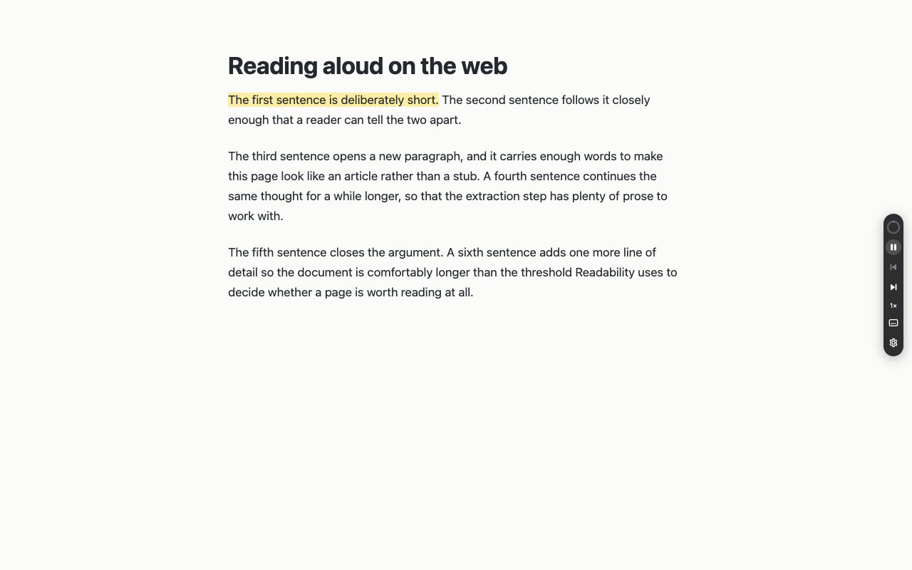
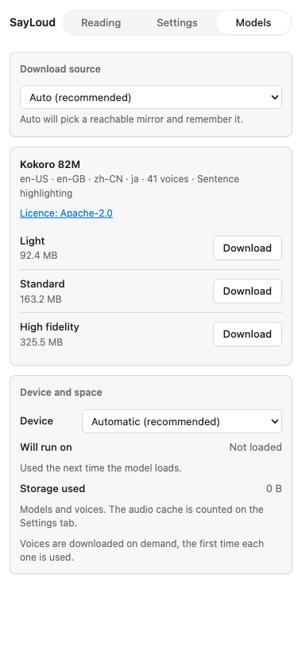
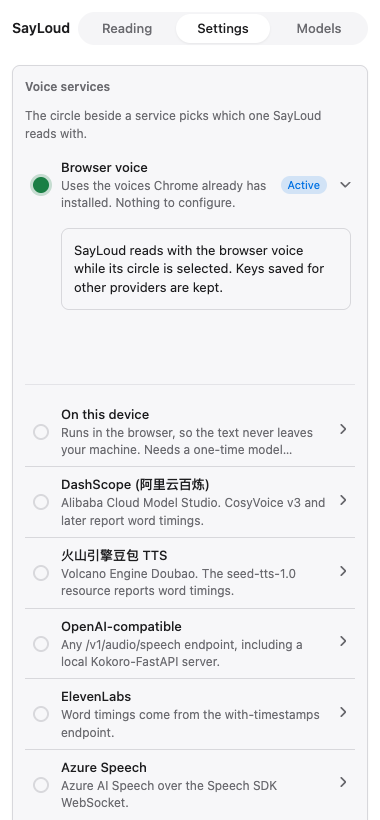
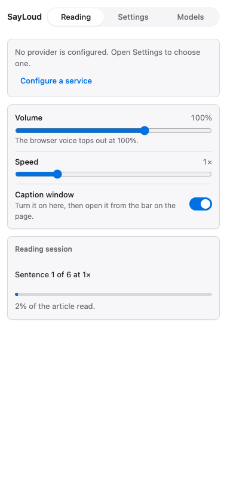
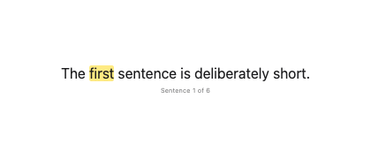

# SayLoud

**English** · [中文](README.zh.md) · [日本語](README.ja.md)

SayLoud reads web pages aloud in Chrome. It highlights the sentence being read,
and — with a voice that reports word timings — each word as it is spoken.



## What it does

- **A bar on the page, not a wall of settings.** Click the toolbar icon and a
  28px bar appears on the right edge: play/pause, previous/next sentence, speed,
  a progress ring with the time left, the caption window, and a way into
  settings.
- **Sentence-level, and word-level where it can be.** The sentence is the
  baseline for every voice; words light up as they are spoken when the voice
  reports when each one starts.
- **Click a sentence to start from there.** Reading begins at the sentence you
  pick, not at the top of the page.
- **Speed 0.5×–3×, volume 0–150%.** Both apply to the sentence playing now.
- **Keeps reading when you leave the tab.** You can work in another tab while it
  reads.
- **Auto-scroll that yields.** The page follows the reading position, and stops
  the moment you scroll yourself; a card offers to jump back to the sentence.
- **A caption window you can put anywhere** — the sentence and its position, in
  a small always-on-top window.
- **Nothing to configure to start.** The browser voice needs no account, no key
  and no network.

## Three ways to be read to

| | What it takes | Where your text goes | Word highlighting |
|---|---|---|---|
| **Browser voice** | nothing at all | nowhere — it is your system's speech | from the browser's own word events |
| **On this device** | one model download | nowhere — the model runs in your browser | whole sentences |
| **A cloud service** | your own API key | to that service, and nowhere else | from the service's timestamps |

### On this device

Kokoro 82M, downloaded once from the Models tab: 41 voices across English
(en-US, en-GB), Chinese (zh-CN) and Japanese (ja). Three sizes — 92 MB, 163 MB
and 326 MB — and a choice of WebGPU or CPU; the tab says which one suits your
machine. Voices are fetched the first time each is used. The text never leaves
your computer, and no key is involved.



### Cloud services

Bring your own key for an OpenAI-compatible server (including a local
Kokoro-FastAPI), ElevenLabs, Azure Speech, DashScope (阿里云百炼) CosyVoice and
Qwen-TTS, or 火山引擎豆包. Services that report word timings get word-by-word
highlighting; the rest fall back to whole sentences. Keys are kept in Chrome's
own storage, and SayLoud asks for access to a site only when you configure a
service for it.



## Using it

1. Open an article and click the SayLoud icon in the toolbar. Nothing is
   injected into a page until you ask for it — the extension has no standing
   access to the pages you read.
2. The bar appears on the right edge. Press play, or click any sentence in the
   page to start from there.
3. Open the side panel for progress, voice, cache and model settings.



The caption window, opened from the bar, keeps the current sentence on top of
other windows:



## Settings

- **Voice** — one voice per service, with a searchable list showing which voices
  report word timings. A voice can also be typed in by id.
- **Speed, volume, caption window** — the preferences that matter mid-sentence,
  on the Reading tab, so they are one click away while it reads.
- **Interface language** — English, 中文, 日本語, or follow the browser.
- **Cache** — synthesized audio is kept on your machine, so replaying a sentence
  costs nothing. On by default, with an upper limit of 50, 100, 200 or 500 MB
  (200 MB out of the box), a readout of what is used, and one button to clear it.
- **Models** — download source (automatic, Hugging Face, ModelScope or your own
  mirror), the model size, and the device the model runs on.

## Privacy

SayLoud has no server of its own and collects nothing. The browser voice and the
on-device model are entirely local. If you configure a cloud service, the text
you ask it to speak is sent from your browser straight to that service with your
key — to nobody else. Access to a site is requested only when a service needs it,
and can be withdrawn from Chrome's extension settings at any time.

## Install

SayLoud is not on the Chrome Web Store yet. It builds from source in two steps:

```bash
pnpm install
pnpm build
```

Then open `chrome://extensions`, turn on **Developer mode**, choose **Load
unpacked**, and select `.output/chrome-mv3`. You need Node.js 22 or later and
pnpm 9 or later; the build compiles a small Rust module to wasm, so it also needs
a Rust toolchain and `wasm-pack` (`cargo install wasm-pack`).

Current Chrome works. The caption window needs Chrome 116 or later; without it
the rest of SayLoud reads aloud as usual and the caption switch says so.

*The Chrome Web Store listing is coming.*

## License

MIT. Development notes — architecture, tests, the data generators — are in
[CONTRIBUTING.md](CONTRIBUTING.md).
