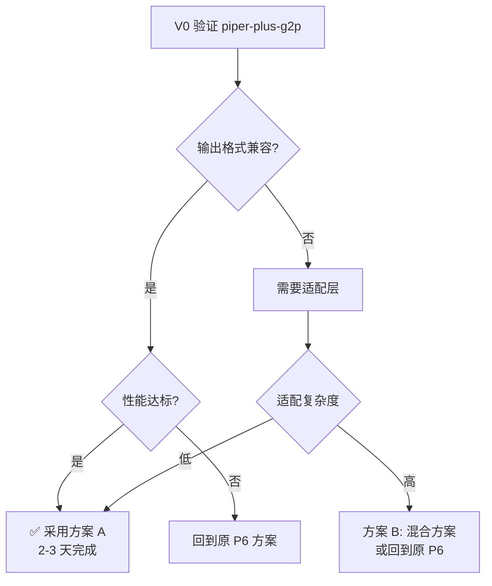

# P6 实施方案决策摘要

**日期**: 2026-10-03  
**状态**: ❌ V0 验证完成 —— `@piper-plus/g2p` 不通过

---

## 核心发现

通过调研 **piper-plus-g2p**、**jpreprocess**、**haqumei** 三个库，发现：

**piper-plus-g2p 是一个现成的、生产级的多语言 G2P 解决方案**，完全覆盖我们的需求：

- ✅ 支持中日英三语（以及韩/西/法/葡/瑞典）
- ✅ MIT 许可，避免 GPL 传染
- ✅ npm 包 `@piper-plus/g2p`，开箱即用
- ✅ 日语基于 OpenJTalk，含完整韵律支持
- ✅ 英文规则驱动，无需 espeak-ng
- ✅ WebAssembly 就绪，浏览器原生运行

---

## 方案对比

### 原 P6 方案（24 任务，估算 2-3 周）

```
自建 Rust crate:
  - 日语: lindera + 手工假名映射表
  - 中文: pinyin 表 + jieba
  - 英文: espeak-ng (GPL，C 编译)
  
问题：
  ❌ espeak GPL 许可
  ❌ C 代码编译复杂
  ❌ 三套独立实现
  ❌ 日语映射表需手工维护
  ❌ 维护成本高
```

### 新方案 A：piper-plus-g2p（推荐，估算 2-3 天）

```
直接使用:
  npm install @piper-plus/g2p
  
优势：
  ✅ 一个库搞定三种语言
  ✅ MIT 许可
  ✅ 上游维护，质量保证
  ✅ 无需编译 C/Rust
  ✅ 日语 OpenJTalk 完整实现
  
待验证：
  ❓ Kokoro vocab 兼容性
  ❓ 性能（冷启动 < 100ms）
  ❓ wasm 大小（< 5 MB）
```

---

## 决策树



---

## V0 验证清单

### 必须完成（决策前）

1. **安装测试**
   ```bash
   npm install @piper-plus/g2p
   node -e "const {g2p} = require('@piper-plus/g2p'); console.log(g2p('hello', 'en'));"
   ```

2. **输出格式对比**
   - 中文样本 10 条 vs 现有 JS 链
   - 日语样本 10 条 vs kuroshiro
   - 英文样本 10 条 vs espeak wasm

3. **Vocab 兼容性**
   - 对照 v1.0 vocab（115 字符）
   - 对照 v1.1-zh vocab（172 字符）
   - 记录所有不匹配字符

4. **性能基准**
   - wasm 加载时间（目标 < 100ms）
   - 单句耗时（中文 < 1ms，日语 < 1ms，英文 < 5ms）
   - 内存占用（< 50 MB）

### 可选（验证后）

5. API 完整性调研
6. 错误处理测试
7. 边缘用例（数字、标点、混合语言）

---

## 实施路径对比

### 若采用 piper-plus-g2p（方案 A）

**阶段 1：验证**（1 天）
- V0 四项测试
- 记录适配需求

**阶段 2：集成**（1 天）
- 替换 phonemize 目录
- 适配层（若需要）
- 单元测试

**阶段 3：验收**（0.5 天）
- 对照测试 1430 条
- E2E 测试
- 性能验收

**总计：2.5 天**

### 若保留原 P6 方案

**8 个阶段，24 个任务**（见实施计划）

**总计：2-3 周**

---

## 风险评估

### 方案 A 的风险

| 风险 | 概率 | 影响 | 缓解 |
|------|------|------|------|
| vocab 不兼容 | 中 | 高 | V0 提前发现，写适配层 |
| 性能不达标 | 低 | 高 | V0 基准测试，若失败回退 |
| 上游停止维护 | 低 | 中 | fork 并自维护（MIT 许可） |
| 日语韵律不如 OpenJTalk | 低 | 中 | piper 本身基于 OpenJTalk |

### 原方案的风险

| 风险 | 概率 | 影响 | 缓解 |
|------|------|------|------|
| espeak GPL 许可问题 | 高 | 高 | 已知问题，需法务确认 |
| espeak 编译失败 | 中 | 高 | 多平台测试，CI 验证 |
| 日语映射表不完整 | 中 | 中 | 人工补充，测试覆盖 |
| 维护成本持续高企 | 高 | 中 | 三套代码独立维护 |

---

## 成本效益分析

### 开发成本

| 方案 | 时间 | 复杂度 | Rust 工作量 | C 编译 |
|------|------|--------|-------------|--------|
| 方案 A | 2.5 天 | 低 | 0 | 无 |
| 原 P6 | 2-3 周 | 高 | 大量 | 需要 |

### 维护成本（年）

| 方案 | 代码量 | 依赖数 | 手工维护 | 许可风险 |
|------|--------|--------|----------|----------|
| 方案 A | 极少 | 1 | 无 | 低 (MIT) |
| 原 P6 | 大量 | 多 | 映射表 | 高 (GPL) |

### 质量保证

| 方案 | 日语韵律 | 测试覆盖 | 上游支持 |
|------|----------|----------|----------|
| 方案 A | OpenJTalk | 上游测试 | 活跃 |
| 原 P6 | 手工实现 | 自建 | 自维护 |

---

## 建议

**强烈建议先执行 V0 验证**（1 天工作量），因为：

1. **投入极小**：只需安装一个 npm 包并跑测试
2. **收益巨大**：若通过，节省 2 周开发时间 + 长期维护成本
3. **无风险**：若失败，仍可回到原 P6 方案

**V0 验证结果：失败（不通过）**

实测发现：
- ❌ 中文：完全没有 G2P，原样返回汉字（93.3% 字符不在 v1.0 vocab）
- ❌ 日语：无法初始化，包内无 wasm，需外部下载 ~55 MB 词典
- ⚠️ 英文：可用但质量劣于 espeak（2/10 样本有硬错误）
- 📋 详细报告：`tests/v0/v0-summary.md`（subagent 已完成验证）

**若 V0 通过 → 采用方案 A**

- 开发时间：2.5 天 vs 2-3 周（节省 90%）
- 维护成本：极低 vs 高
- 许可风险：无 vs GPL
- 代码质量：上游保证 vs 自建

---

## 下一步

### V0 已完成，现有三个选项

**选项 1（新发现）**: 验证 `piper-plus@0.7.0` 的 Rust wasm（57 MB）
- 上游包自带 Rust wasm + 内置词典（零下载）
- 形态命中 P6 spec（单 wasm、Rust、8 语言）
- 需半天验证：输出格式、vocab 兼容性、性能
- 若通过 → 可能比自建更优

**选项 2**: 直接开始原 P6 方案
- 按 24 任务执行
- 2-3 周完成
- 承担 espeak GPL 风险

**选项 3**: 暂停 P6，等待更多调研
- 深入研究其他方案
- 评估更多备选库

---

**文档路径**:
- 本文档: `docs/superpowers/plans/p6-decision-summary.md`
- 评估详情: `docs/superpowers/plans/p6-g2p-library-evaluation.md`
- 原 P6 计划: `docs/superpowers/plans/2026-10-03-p6-rust-phonemize-spec.md`（3726 行）

